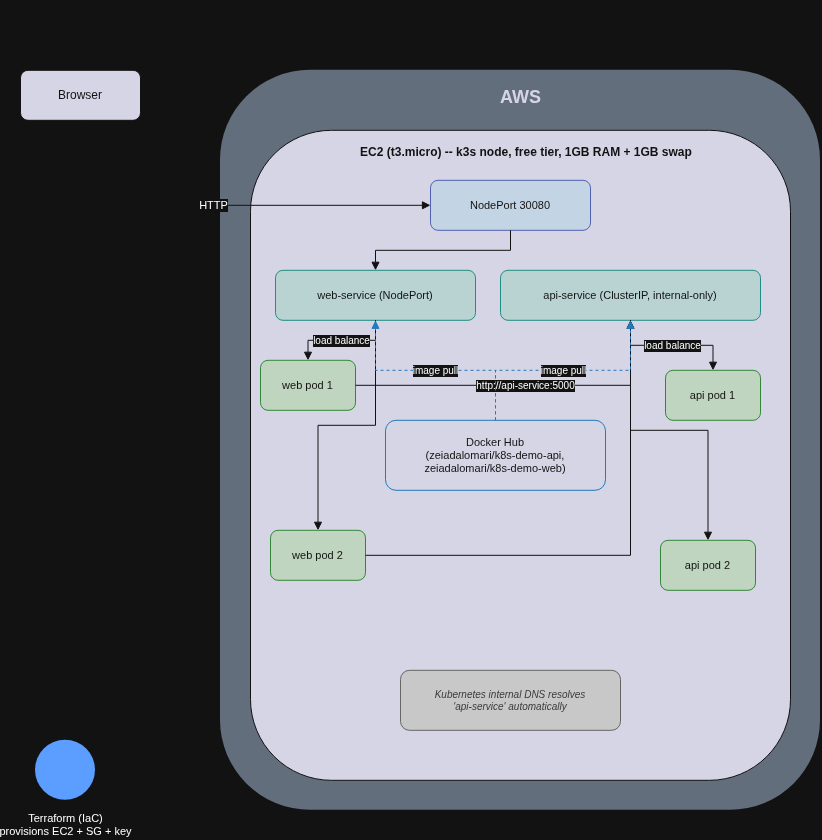

# Project 5: Containerized Microservices on Kubernetes (k3s)

Two Flask microservices (`web` and `api`) deployed on a lightweight Kubernetes cluster (k3s) running on a single AWS EC2 instance. Demonstrates real Kubernetes concepts -- Deployments, Services, internal DNS-based service discovery, and load balancing across replica pods -- entirely within the AWS free tier.

## Architecture

### Traffic flow

    Browser
      |
      v
    http://<node-ip>:30080  (NodePort)
      |
      v
    web-service  --load balances across-->  web pod (x2)
                                                |
                                                v
                                    http://api-service:5000
                                    (Kubernetes internal DNS)
                                                |
                                                v
    api-service  --load balances across-->  api pod (x2)

### Components

| Component | What It Is | Used Here |
|---|---|---|
| Docker | Third-party platform. Packages an application and its dependencies into a portable container. | Containerizes both the `web` and `api` Flask apps |
| Docker Hub | Third-party registry (Docker, Inc.). Public image hosting, free for public repos. | Hosts `zeiadalomari/k8s-demo-api` and `zeiadalomari/k8s-demo-web` |
| k3s | Third-party (Rancher/SUSE). A lightweight, certified Kubernetes distribution designed to run on small/single-node hardware. | Runs the actual Kubernetes control plane and workloads |
| EC2 (t3.micro) | AWS service. Amazon EC2 provides resizable virtual servers; t3.micro is free-tier eligible. | Hosts the k3s node |
| Kubernetes Deployment | Concept/resource type. Manages a set of identical pod replicas and keeps them running. | `api-deployment` and `web-deployment`, 2 replicas each |
| Kubernetes Service | Concept/resource type. A stable network endpoint in front of a changing set of pods. | `api-service` (ClusterIP, internal-only), `web-service` (NodePort 30080, externally reachable) |
| Terraform | Third-party tool (HashiCorp). Cloud-agnostic Infrastructure as Code. | Provisions the EC2 instance, security group, and key pair |

## Why two services instead of one

A single container proves you can run Docker. Two services that talk to each other over the network prove the actual point of Kubernetes: service discovery and load balancing. `web` calls `api` by name (`http://api-service:5000`) -- Kubernetes' internal DNS resolves that name to whichever `api` pod is available, with zero hardcoded IPs.

## Design Decisions

**Why k3s instead of AWS EKS?**
EKS's managed control plane costs ~$0.10/hr (~$73/month) with no free tier at all, even with zero worker nodes. k3s runs entirely on a single, normal, free-tier-eligible EC2 instance -- $0 as long as it stays within free-tier hours.

**Why NodePort instead of a LoadBalancer or Ingress?**
A cloud LoadBalancer (AWS ELB/NLB) bills continuously. Ingress would need Traefik running. NodePort exposes the service directly on the node's own IP and a fixed port, at no additional cost -- the right tradeoff for a single-node free-tier demo.

**Why disable Traefik, ServiceLB, and metrics-server?**
None of them are needed for this architecture (no Ingress, no LoadBalancer-type Services, and `kubectl top` isn't required for this demo) -- and disabling them freed critical memory on a 1GB instance (see Lessons Learned).

**Why a 1GB swap file?**
Added as a safety margin against out-of-memory conditions on a memory-constrained free-tier instance -- directly motivated by a real failure encountered while building this project.

**Why a public Docker Hub repo?**
Makes both images pullable by anyone reviewing this portfolio, and by k3s itself, without managing private registry credentials.

**Why 2 replicas per service?**
The minimum needed to actually demonstrate load balancing across pods, rather than just claiming it works.

## Cost Analysis

| Resource | Free Tier | If Left Running | Production Equivalent |
|---|---|---|---|
| EC2 t3.micro | $0 (750 hrs/month) | ~$7.50/month on-demand | -- |
| Managed Kubernetes (EKS) | Not applicable -- no free tier | -- | ~$73/month control plane alone, plus nodes |
| Docker Hub (public repo) | $0 | $0 | $0 |
| **Total (as built)** | **$0** | | |

Per the fully-free constraint on this project, the EC2 instance is torn down (`terraform destroy`) immediately after capturing the working demo, rather than left running.

## Deployment

### Prerequisites

- AWS CLI configured with credentials
- Terraform >= 1.9
- Docker
- A Docker Hub account (free)

### Deploy

    # Build and push the images (one-time, or after code changes)
    cd app/api  && docker build -t <dockerhub-user>/k8s-demo-api:v1 . && docker push <dockerhub-user>/k8s-demo-api:v1
    cd ../web   && docker build -t <dockerhub-user>/k8s-demo-web:v1 . && docker push <dockerhub-user>/k8s-demo-web:v1

    # Provision the k3s node
    cd terraform
    terraform init
    terraform apply

    # Deploy the app onto the cluster
    scp -i ~/.ssh/project5-key ../k8s/*.yaml ec2-user@<node-ip>:~/
    ssh -i ~/.ssh/project5-key ec2-user@<node-ip> "sudo k3s kubectl apply -f api-deployment.yaml -f web-deployment.yaml"

    # Test
    curl http://<node-ip>:30080/

### Tear down

    cd terraform
    terraform destroy

## What I Learned

- A t3.micro's *default* k3s install -- Traefik, ServiceLB, and metrics-server all enabled out of the box -- consumes nearly all of the instance's 1GB of RAM before a single application pod is deployed, leaving almost no real headroom.
- The first cluster attempt became unresponsive to SSH ("timed out during banner exchange") after running unattended -- a textbook symptom of severe memory pressure, and a reminder in itself about the discipline of tearing resources down rather than leaving them running.
- AWS's own instance status checks (system status + instance reachability) can both report "ok" even while the OS inside is too overloaded to accept new connections -- those checks verify infrastructure-level health, not application-level responsiveness, so they're not sufficient on their own for diagnosing a stuck box.
- Disabling unused k3s add-ons (`--disable traefik --disable servicelb --disable metrics-server`) plus a 1GB swap file turned a barely-alive instance (39Mi memory available) into a healthy one (consistently 280-400Mi available) with the exact same application workload.
- NodePort is sufficient for externally exposing a service without needing Ingress or a paid cloud LoadBalancer.
- Kubernetes' internal DNS -- a Service name like `api-service` resolves automatically inside the cluster -- is what actually lets microservices find each other without hardcoded IPs, and is the core concept this project was built to demonstrate.
